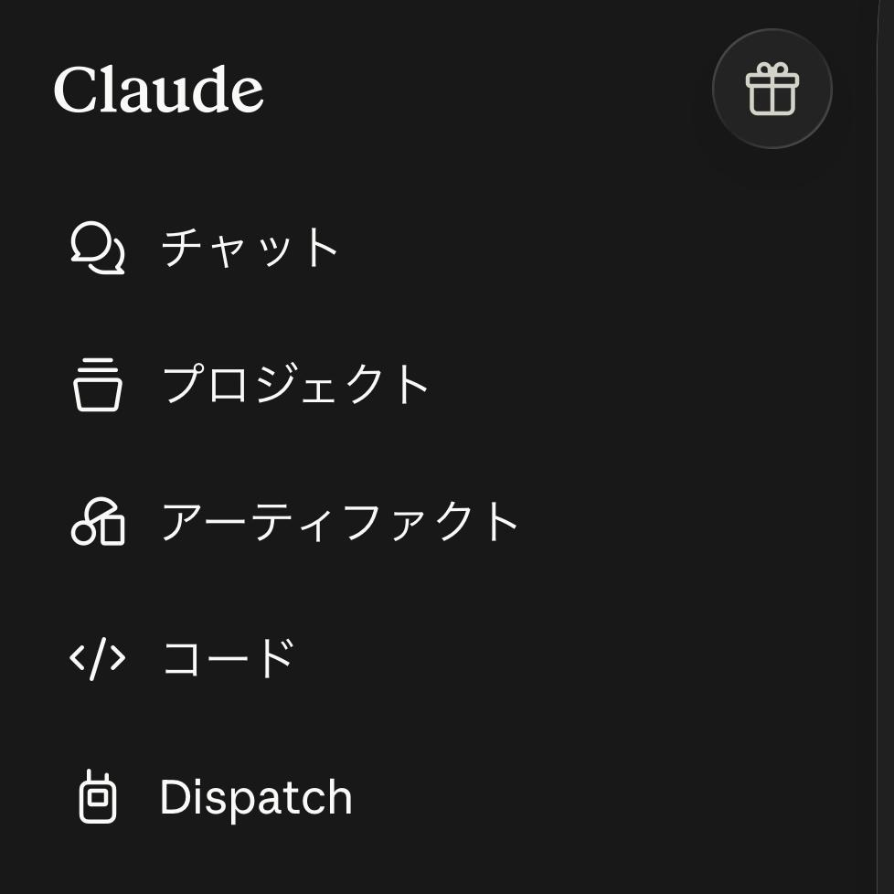
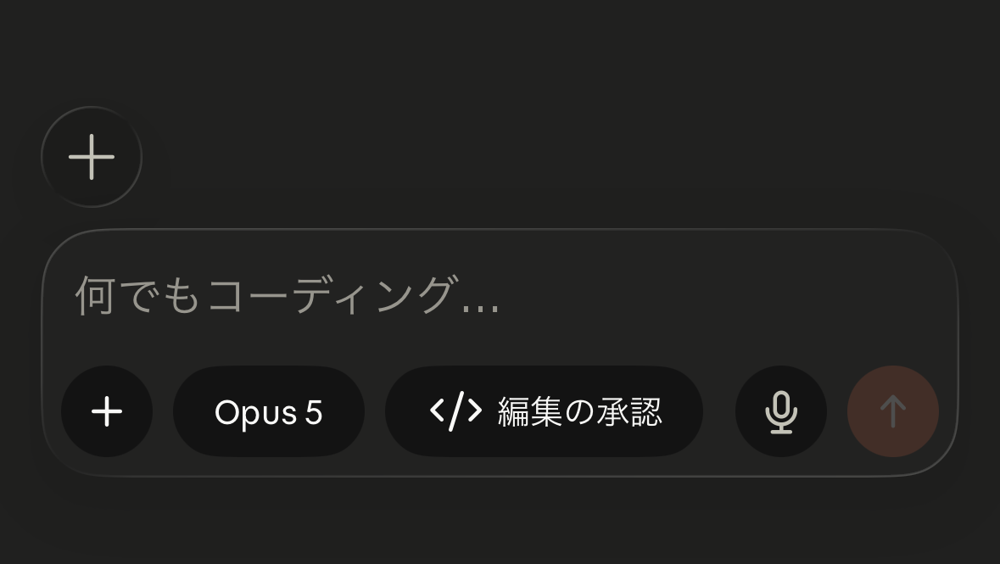
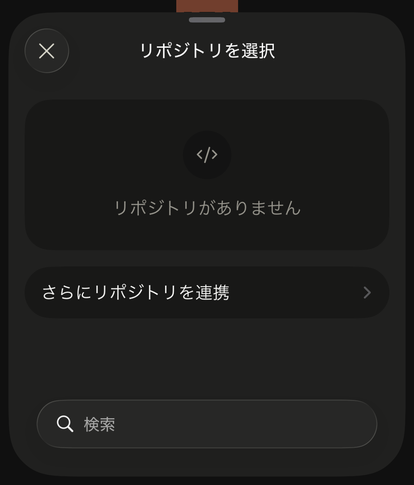
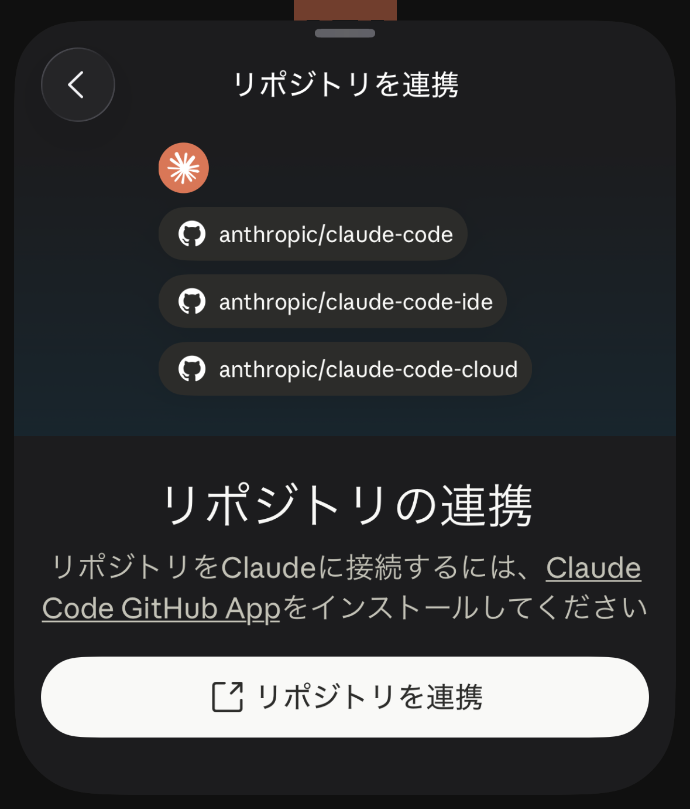
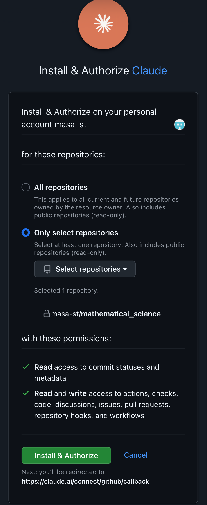
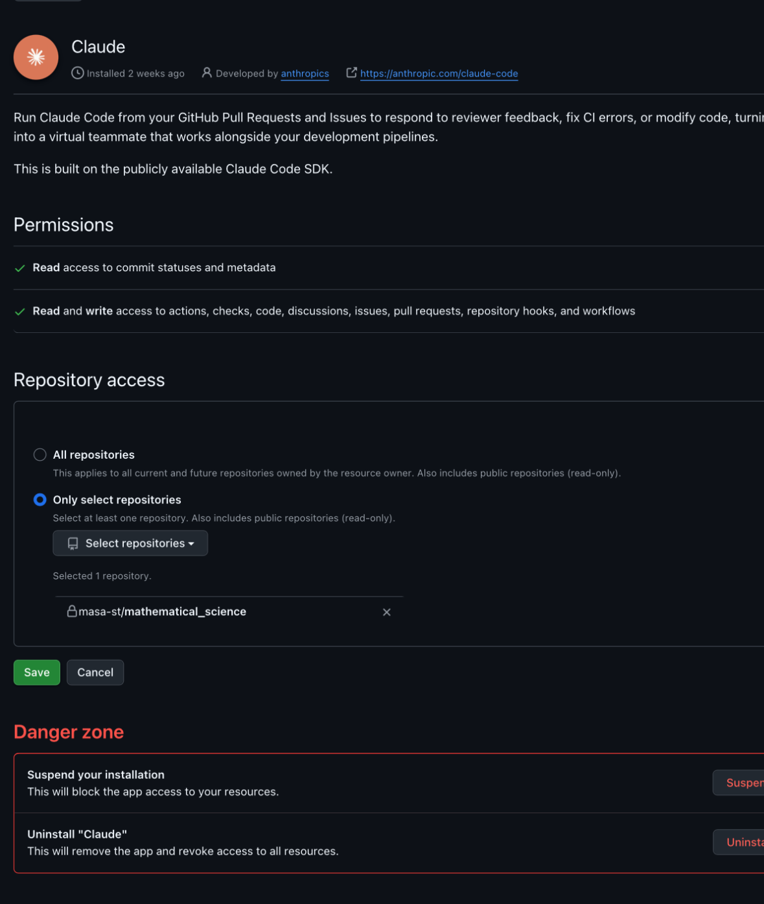
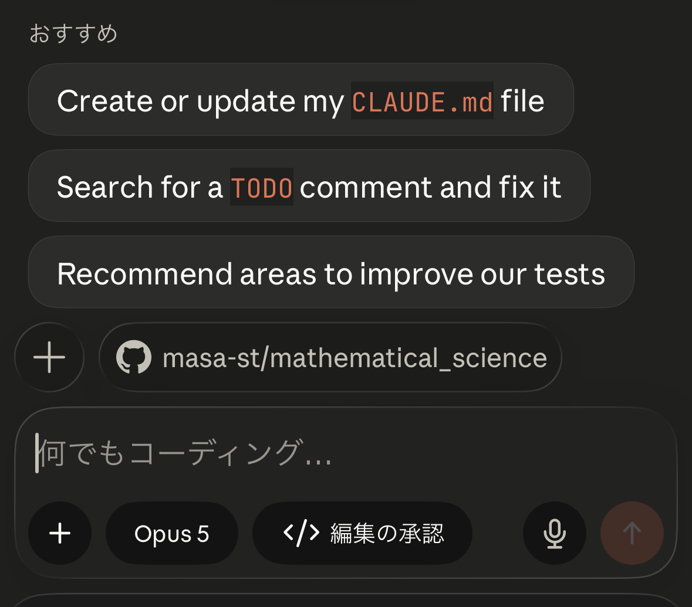
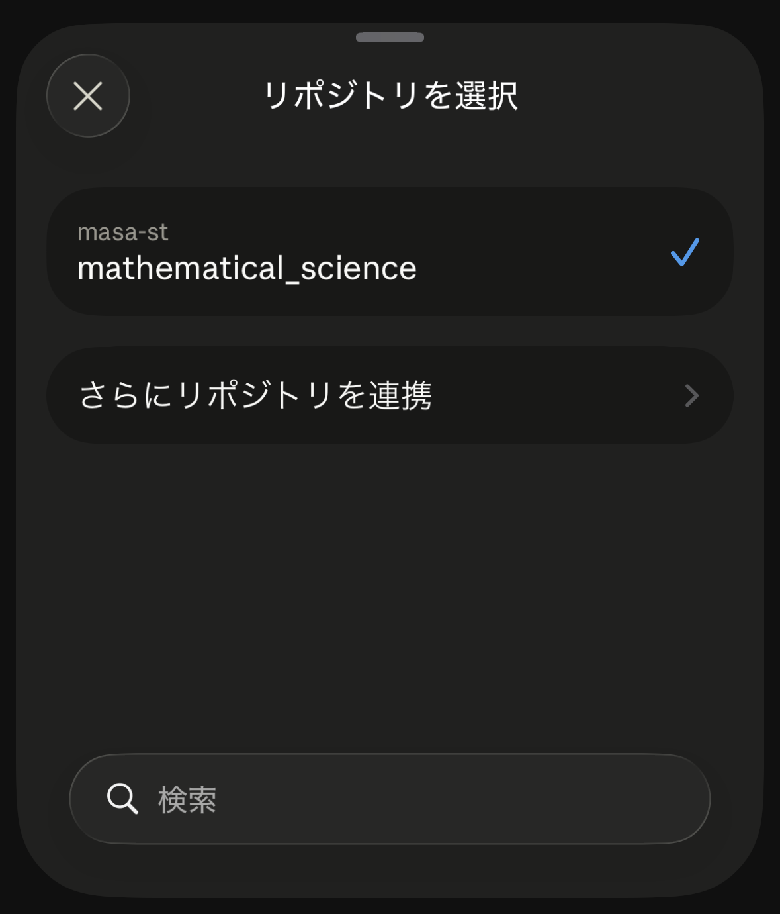
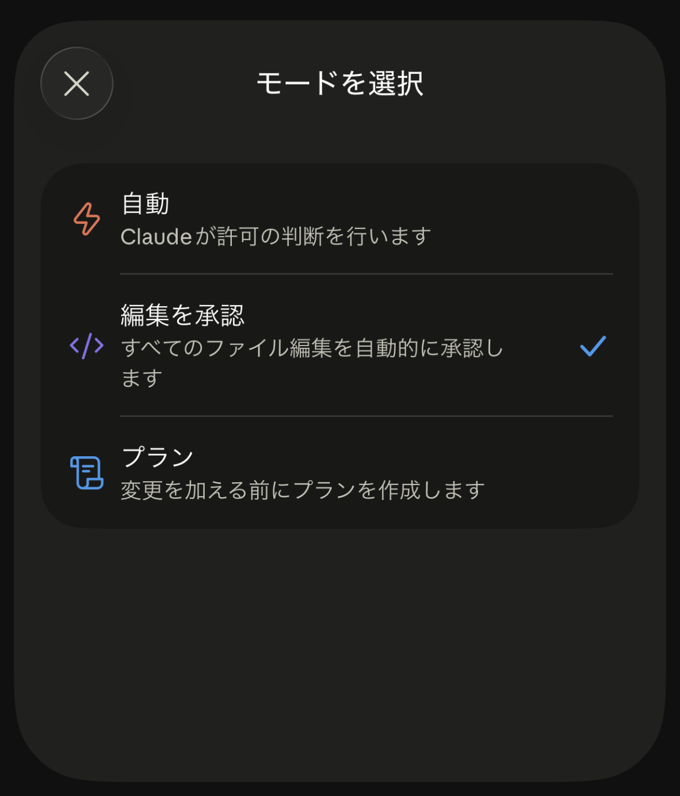
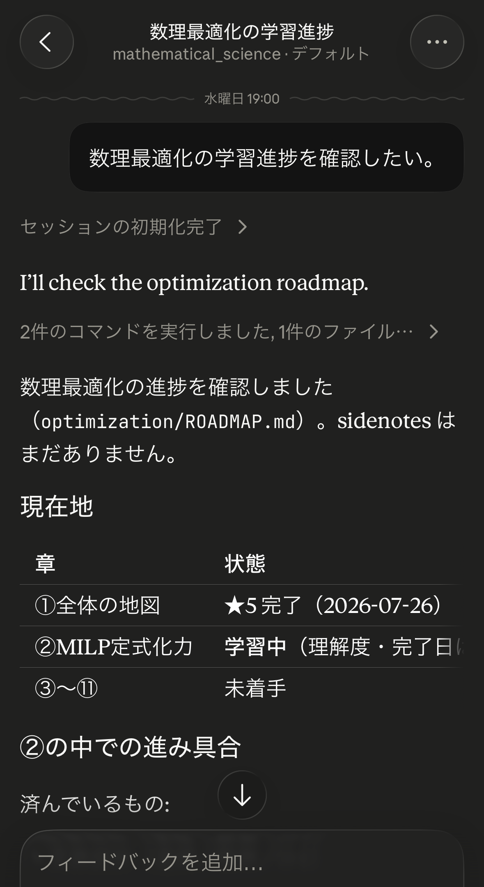

# Claude Code モバイルアプリと GitHub リモートリポジトリの連携マニュアル

スマホの Claude アプリからこのリポジトリを操作し、学習記録を GitHub に残すための手順です。
初回だけ必要な設定（1〜3 章）と、毎回の操作（4 章以降）に分けてあります。

> このドキュメントは学習ロードマップ（`*/ROADMAP.md`）とは無関係の環境構築メモです。
> 学習セッションの進行には関与しません。

## 1. 前提条件

- **Claude の Pro または Max プラン**（個人アカウント）にサインインできること。
- **学習記録を置く GitHub リポジトリ**があること。新しく始める場合は、先に
  [github.com/new](https://github.com/new) で空のリポジトリを作っておく。
- **iPhone / Android**（iPad も可）。

## 2. Claude アプリを準備する

1. **アプリを入れる** — Claude アプリを
   [iOS](https://apps.apple.com/us/app/claude-by-anthropic/id6473753684) または
   [Android](https://play.google.com/store/apps/details?id=com.anthropic.claude) から
   インストールする。
2. **サインインする** — Pro / Max プランの claude.ai アカウントでサインインする。
3. **「コード」を開く** — アプリを開いて**左上のボタン**をタップするとメニューが開くので、
   その中の **コード** を選ぶ。

## 3. GitHub と Claude アカウントを接続する（初回だけ）

### 3-1. まず用語の整理: Claude GitHub App は「GitHub 側に入れるアプリ」

これから入れる **Claude GitHub App は、スマホにインストールするアプリではありません。**
GitHub アカウントに追加する連携アプリ（GitHub App）で、GitHub の Slack 連携や CI サービスを
入れるのと同じ種類のものです。スマホに新しいアイコンが増えることはありません。

これを入れることで、Claude 側があなたの GitHub リポジトリを clone したり、
作業ブランチを push したりできるようになります。

まとめると、登場するものは次の 3 つです。

- **Claude アプリ**（スマホに入れる） — 2 章で入れたもの。操作画面。
- **Claude GitHub App**（GitHub アカウントに入れる） — 本章で入れるもの。リポジトリへの通行証。
- **GitHub リポジトリ** — 学習記録の保存先。

### 3-2. アプリから連携を始める

まだ GitHub を連携していない状態で **コード** の画面を開くと、リポジトリのボタンがなく、
入力欄の上に **+** だけが出ています。

**+** をタップすると **リポジトリを選択** が開きますが、**リポジトリがありません** と
表示されます。ここで **さらにリポジトリを連携** を選びます。

**リポジトリを連携** の画面に切り替わり、「リポジトリを Claude に接続するには、
Claude Code GitHub App をインストールしてください」と案内が出ます。
白い **リポジトリを連携** ボタンをタップすると GitHub のサイトに移動します。

### 3-3. GitHub でインストールと認可を行う

移動先は **Install & Authorize Claude** という画面です。インストール先のアカウント、
許可するリポジトリ、与えられる権限が 1 画面にまとまっています。

上部の「Install & Authorize on your personal account ...」で、自分の GitHub
アカウントが対象になっていることを確認します。

続いて、App にアクセスを許可するリポジトリの範囲を選びます。選択肢は 2 つです。

- **All repositories** — 現在および今後作るすべてのリポジトリを対象にする。
- **Only select repositories** — 選んだリポジトリだけを対象にする。

**ここでは Only select repositories を選び、学習進捗の管理に使うリポジトリ
（このテンプレートから作った自分のリポジトリ）だけを指定してください。** 他のリポジトリは入れません。

理由は 2 つあります。**ここで許可したリポジトリが、そのまま Claude アプリの
リポジトリセレクタに並ぶ**ため、学習と無関係なリポジトリを入れておくと、
セッションを始めるたびに選択肢に混ざって紛らわしくなります。また、
学習用以外のリポジトリを Claude が触れる状態にしておく理由もありません。

なお、どちらを選んだ場合も、GitHub の画面に
「Also includes public repositories (read-only)」と書かれているとおり、
パブリックリポジトリは読み取り専用で対象に含まれます。
選択によって制御できるのはプライベートリポジトリだと考えておくとよいです。

その下の **with these permissions:** に出ているとおり、許可したリポジトリに対して、
コードの読み書きから PR・Issue・Actions の操作までが App に与えられます
（個別に選ぶことはできません）。許可するリポジトリを絞るのは、このためでもあります。

最後に緑色の **Install & Authorize** を押します。GitHub のパスワードや 2 要素認証を
求められることがあります。

### 3-4. 接続できたことを確認する

インストールが終わると Claude 側に戻ります。**コード** の画面にプロンプトの入力欄と
リポジトリのボタンが出ていれば接続完了です（4 章の画像を参照）。

### 3-5. 後からアクセス範囲を変える

一度決めた範囲は GitHub 側でいつでも変更できます。

1. github.com にサインインする。
2. 右上のアイコンから **Settings** を開く。
3. 左メニューの **Applications** →  **Installed GitHub Apps** を開く。
4. 一覧の **Claude** の **Configure** を開く。
5. **Repository access** の欄でリポジトリを追加し、最後に **Save** を押す。
6. 連携そのものをやめたい場合は、**Danger zone** の **Uninstall** を使う。

### 補足: PC で GitHub CLI を使っている場合

普段 PC で `gh` コマンドを使っているなら、ブラウザを開かずに接続することもできます。
PC のターミナルで `gh auth login` を済ませたうえで、Claude Code CLI を起動し、
その中で `/login`（claude.ai アカウントでサインイン）→ `/web-setup` を実行します。
成功すると `Connected as <あなたの GitHub ユーザー名>` と表示されます。
スマホだけで完結させたい場合は不要です。

## 4. セッションを開始する（毎回の操作）

**コード**の画面で以下を行います。

1. **リポジトリを選ぶ** — 入力欄の上に出ているリポジトリのボタン
   （`<ユーザー名>/<リポジトリ名>` のように表示される）をタップすると
   **リポジトリを選択** が開くので、学習用のリポジトリを選ぶ。
2. **権限モードを選ぶ** — 入力欄の中の **編集の承認** と書かれたボタンをタップすると
   **モードを選択** が開き、次の 3 つから選べる。
   **このリポジトリの学習セッションは既定の 編集を承認 のままでよい。**
   - **自動** — Claude が許可の判断を行う
   - **編集を承認** — すべてのファイル編集を自動的に承認する（既定）
   - **プラン** — 変更を加える前にプランを作成する
3. **やりたいことを書いて送信する** — 例:「統計検定準1級の続きから始めたい」
   「○○を学び始めたい」。このリポジトリでは `CLAUDE.md` が自動で読み込まれるため、
   Claude 側から「どの分野を学びますか」「前回はここで止まっています」と聞いてくる。

**アプリを閉じてもセッションは走り続けます。** 途中で質問された場合、後から戻って
答えればそこから再開されます。

実際のセッションの例です（画像はこのテンプレートの作成元リポジトリでのもの）。
どの分野でも、`CLAUDE.md` に従って Claude が対象分野の
`ROADMAP.md` を読み、前回の続きを提示するところから始まります。

## 5. このリポジトリ固有の運用

一般的な Claude Code の使い方と違う点があります。詳細は [`CLAUDE.md`](./CLAUDE.md) の
「Git運用」にあります。

- **プルリクエストを作らない。** ドキュメント編集が中心でレビューを要さないため、
  **作業ブランチへの commit・push が完了した時点で作業終了**です。
- **デフォルトブランチへのマージは自動。** Stop フック
  `.claude/hooks/auto-merge-to-default.sh` が、作業ブランチがクリーンかつ push 済みの
  ときだけデフォルトブランチにマージして push します。Claude 自身がマージ操作をする
  必要はなく、可否をユーザーに確認する必要もありません。
- **未コミットのまま終われない。** もう一つの Stop フック `check-uncommitted.sh` が、
  未コミット・未追跡・未 push の変更が残っているとセッション終了をブロックします。
  作業はクラウド上の使い捨ての仮想マシンで行われ、その中身は残らないため、
  push されていない変更は失われます。この安全装置は意図的なものです。
- **作業ブランチ名は `claude/...`** の形で自動的に付きます。マージ後もブランチは
  削除せず残しておいて構いません。
- **セッションの終わり方**は、`/wrapup` と打つか「今日はここまで」と伝えるだけで、
  ロードマップ更新から commit・push まで一連の処理が走ります。

## 6. うまくいかないときは

| 症状 | 原因と対処 |
|---|---|
| **リポジトリを選択** に「リポジトリがありません」と出る | GitHub 未連携。3 章の手順を行う |
| リポジトリが一覧に出てこない | 接続した GitHub アカウントがそのリポジトリにアクセスできるか確認する |
| メニューに **コード** が見当たらない | サインインしているアカウントが Pro / Max プランか確認する |
| `Session creation failed` と出る、provisioning で止まる | 仮想マシンの確保に失敗している。[status.claude.com](https://status.claude.com) を確認し、1 分ほど待って再試行する |
| セッションが expired と表示される | 放置により仮想マシンが回収された。セッションを開き直すと、会話履歴を引き継いだ新しいものが立ち上がる |
| アプリを閉じてもセッションが終わらない | 仕様。Claude が現在のタスクを終えるまで走り、その後アイドルになる。整理したければアーカイブ、消したければ削除する |

## 7. 注意点

- **セッションの共有には注意。** Pro / Max アカウントでのセッション共有の可視性は
  **Private** か **Public**（= claude.ai にログインしている全ユーザーが閲覧可能）の
  2 択で、リポジトリのアクセス権チェックは既定で無効です。プライベートリポジトリの
  内容が含まれうるので、共有する前に中身を確認してください。
- **PC 側の設定は使われない。** セッションが見るのはリポジトリの中身だけで、
  PC の環境やツールは引き継がれません。リポジトリにコミットした
  `CLAUDE.md` / `.claude/settings.json` / フックは有効です。

## 参考

- [Claude Code on the web の入門](https://code.claude.com/docs/en/web-quickstart)
- [Claude Code on mobile](https://code.claude.com/docs/en/mobile)
- [Claude Code on the web リファレンス](https://code.claude.com/docs/en/claude-code-on-the-web)
